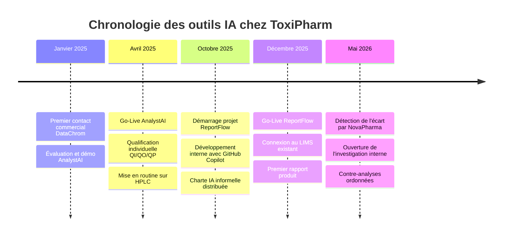

# PAGE 1 — ACCUEIL ET CONTEXTE COMMUN
## Exercice ToxiPharm — Atelier "Gouvernance et Human Oversight en environnement BPL"

---

## Bloc A — ToxiPharm : présentation de l'entreprise

**ToxiPharm SAS** est un laboratoire d'études toxicologiques précliniques basé en région lyonnaise ; il emploie environ 80 collaborateurs. L'entreprise opère sous **Bonnes Pratiques de Laboratoire (BPL OCDE)** et est **inspectée régulièrement par l'autorité française (ANSM)**. Elle est également accréditée ISO 17025 pour ses méthodes analytiques.

**Activité** : ToxiPharm conduit des études réglementaires de toxicité pour le compte de sponsors pharmaceutiques internationaux : toxicité aiguë, subaiguë, chronique, génotoxicité, études de stabilité associées. Ces études sont des **livrables critiques** pour les dossiers de demande d'Autorisation de Mise sur le Marché (AMM) déposés à l'EMA et à la FDA. Une étude pivotale dure typiquement 6 à 12 mois et produit un rapport final de 200 à 400 pages.

**Organisation** : ToxiPharm est structurée en trois grands services :
- le Département Études Précliniques (in vivo et in vitro), 
- le Département Analytique (chimie analytique, bioanalyse) qui produit toutes les données chimiques des études,
- et le Département Rédaction Scientifique et Affaires Réglementaires qui consolide les données en rapports d'étude conformes aux templates ICH. 
L'équipe Qualité repose sur un Responsable Assurance Qualité (RAQ), assisté de deux assistants qualité. Le Directeur d'Études (DE) signe les rapports finaux conformément aux BPL.

**Sponsors clés** : ToxiPharm travaille avec une vingtaine de sponsors récurrents. Le principal, **NovaPharma**, représente 35% du chiffre d'affaires et conduit actuellement le développement d'un antiviral, le ZB-37, en phase III. Plusieurs études toxicologiques sont en cours sur cette molécule.

## Bloc B — Les enjeux de ToxiPharm

ToxiPharm évolue dans un marché concurrentiel où les concurrents est-européens pratiquent des prix significativement inférieurs. La direction a engagé depuis deux ans une stratégie d'industrialisation de la production de rapports pour rester compétitive sans dégrader la qualité.

Dans ce cadre, deux outils d'IA ont été déployés successivement :
- **AnalystAI**, pour automatiser le traitement des chromatogrammes analytiques. Cette solution a été achetée à l'éditeur **DataChrom** qui commercialise cette solution.
- **ReportFlow**, pour accélérer la rédaction des rapports d'étude. Cette solution a été développée en interne, par une personne du service qualité, avec l'aide de GitHub Copilot.

Ces deux outils ont été qualifiés et validés lors de leur mise en service par une démarche de QI, QO, QP qui ont été statuées conformes aux procédures internes.
La direction est satisfaite des gains de productivité observés : **+40% sur la rédaction de rapports**, **+25% sur le traitement analytique**.

## Bloc C — La problématique : le déclencheur

12 mai 2026, 14h22 - L'étincelle

Sarah Reinhardt, Director Regulatory Affairs chez NovaPharma, envoie un courriel à la Direction Générale de ToxiPharm. Le ton est sec, presque cassant et inhabituel de la part de ce partenaire historique.

> *"Lors de la revue interne du rapport d'étude ZB-2024-087 que vous nous avez livré il y a trois semaines, mes équipes ont relevé plusieurs anomalies qui ne sont pas acceptables à ce niveau de criticité.*
>
> *Sur le plan rédactionnel d'abord : la référence **Martinez & Schmidt (2024)** citée en section 4.3 est absolument **introuvable** dans toutes les bases consultées (PubMed, Scopus, Web of Science). Après vérification complète 11 autres références citées en discussion sont mal paginées et leurs DOI n'existent pas. La conclusion de la section 5.2 affirme une "absence d'effet dose-réponse" alors que les données du tableau 4.7 montrent clairement une tendance croissante. Enfin, plusieurs valeurs numériques citées dans le texte ne correspondent pas exactement aux valeurs des tableaux sources.*
>
> *Ces incohérences sont plus que préoccupantes pour un document qui doit alimenter notre dossier AMM. Je vous demande une explication formelle et une revue exhaustive du rapport sous 48h. Je rappelle que ce dossier est attendu par l'EMA en juin et que tout retard sur ce point a des conséquences directes sur notre planning de dépôt."*

12 mai 2026, 17h00 - L'investigation interne.

Le Directeur Général réunit en urgence le RAQ, le responsable Rédaction Scientifique et le Directeur d'Études. La première hypothèse de travail est que le problème est cantonné à la phase de rédaction : les hallucinations sont identifiées comme un risque connu de l'IA Générative et le rédacteur scientifique a surement validé un peu vite un brouillon de ReportFlow. A ce stade une relecture du rapport et des excuses au sponsor devraient permettre de passer à autre chose.

En parcourant le rapport pour préparer la réponse au sponsor, le RAQ tombe sur une conclusion inhabituelle concernant le profil de l'impureté X. Le RAQ demande à voir les chromatogrammes bruts.

13 mai 2026 - La découverte d'ampleur.

L'examen des logs d'AnalystAI révèle que **trois échantillons (lots #14, #17, #21)** ont été signalés par le système avec un **score de confiance inférieur au seuil interne de 80%** (62%, 71%, 58%). Ces alertes auraient théoriquement dû déclencher une "vérification approfondie" prévue par la procédure. Les trois résultats ont été validés sans modification par les techniciens de laboratoires.

Le RAQ demande une **contre-analyse manuelle** des échantillons de réserve sur les trois lots concernés. Les résultats tombent quelques jours plus tard :

| Lot | Valeur déclarée (rapport) | Contre-analyse | Écart |
|-----|---------------------------|----------------|-------|
| #14 | 0,087 % | 0,120 % | +38 % |
| #17 | 0,094 % | 0,135 % | +44 % |
| #21 | 0,081 % | 0,089 % | +10 % |

**L'échantillon du lot #17 dépasse désormais la spécification ICH Q3A**. Ce constat montre que l'incident autour de l'IA est bien plus grave que prévu. C'est un problème de **données analytiques erronées**, **rédigées avec assurance** par l'IA générative, et **non détectées**, ni par les techniciens, ni par le rédacteur, ni par le Directeur d'Études signataire.

La situation actuelle.

Le sponsor a été informé. NovaPharma a suspendu son dépôt AMM en attendant l'analyse d'impact complète. Le sponsor a également notifié l'ANSM de cette anomalie dans une étude BPL. Une inspection BPL anticipée est probable dans les 30 prochains jours. 
Cinq autres rapports produits via la chaîne IA depuis 5 mois sont potentiellement concernés. Quatre autres sponsors doivent être prévenus.

La Direction Générale demande un dossier complet sous 5 jours, comprenant : l'analyse des défaillances, le plan de remédiation immédiat, et les principes structurants d'une politique IA d'entreprise à présenter au prochain comité.**

## Bloc D — Frise chronologique du déploiement IA chez ToxiPharm

**Lecture de la frise.**
- Entre le contact commercial et le Go-Live d'AnalystAI : **3 mois** (cycle normal d'un outil acheté chez un éditeur, avec qualification standard).
- Entre les deux Go-Live : **8 mois**. ReportFlow a été conçu et livré sans rouvrir la qualification d'AnalystAI ni de la chaîne complète.
- Entre le Go-Live de ReportFlow et la détection de l'écart : **5 mois et 6 rapports d'étude produits**.
- **17 mois** se sont écoulés entre les premières discussions sur AnalystAI et la révélation du dysfonctionnement par le sponsor.

---

## Bloc E — Vos missions

**Vous êtes les enquêteurs mandatés par le RAQ.** Le RAQ a choisi de séparer l'enquête en deux équipes pour gagner du temps et faire émerger sans biais les défaillances propres à chaque système IA. Vous travaillerez en parallèle sur l'un des deux outils, puis un débrief croisé permettra de reconstituer la chaîne complète des défaillances.

**Groupe 1 — Enquête sur AnalystAI.** Vous investiguez l'outil de traitement analytique. Vous avez accès à un descriptif technique du système, à un schéma de fonctionnement, et aux verbatim de six personnes qui interagissent avec AnalystAI au quotidien.

**Groupe 2 — Enquête sur ReportFlow.** Vous investiguez l'outil de rédaction. Vous avez accès à un descriptif technique du système, à un schéma de fonctionnement, et aux verbatim de six personnes qui interagissent avec ReportFlow au quotidien.

**Pour chaque équipe, trois livrables à produire en 50 minutes :**

1. **Cartographie des défaillances de gouvernance et de Human Oversight propres à votre système** (4 à 6 défaillances, avec pour chacune : responsabilité attendue, ce qui a effectivement été fait, cause profonde)
2. **Positionnement HITL** : à l'aide de la grille des 4 niveaux fournie, quel niveau de Human-in-the-Loop aurait dû s'appliquer à chaque étape critique de votre système, et pourquoi
3. **Trois principes structurants** que vous recommandez d'intégrer dans la future politique IA de ToxiPharm sur la base de votre enquête

Le débrief croisé (20 minutes) permettra de reconstituer la chaîne complète et de faire émerger ce qu'aucune des deux enquêtes isolées ne pouvait voir.