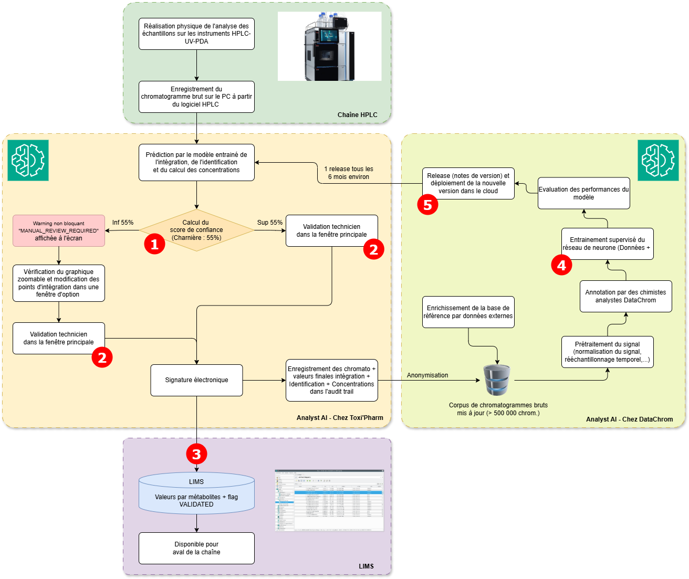

# PAGE 2 — ANALYSTAI (Groupe 1 — Sujet ML/DL)
## Outil de traitement analytique automatisé

## Onglet 2.1 — Comment fonctionne le système

**Volume traité** : Le laboratoire CQ de Toxi'Pharm emploie 8 techniciens analytiques. Ils analysent et vérifient environ 200 chromatogrammes par technicien et par semaine.

**Le fournisseur** : Le fournisseur s'appelle **DataChrom SAS**. Il s'agit d'une PME française de 45 personnes basée à Strasbourg, spécialisée dans le traitement automatisé de données chromatographiques. L'entreprise présente une vingtaine de laboratoires clients en Europe, essentiellement dans le domaine de l'agro-alimentaire et des eaux ; 2 client stravaillent en environnement BPL.

**Fonction.** AnalystAI s'appuie sur un modèle de *Deep Learning* supervisé (réseaux de neurones entraînés sur une base massive de chromatogrammes annotés par des chimistes analystes de divers secteurs d'activités). Le logiciel récupère automatiquement les chromatogrammes bruts en sortie des instruments HPLC du laboratoire. Pour chaque chromatogramme, il effectue :
1. l'intégration des pics chromatographiques, 
2. l'identification des composés contre une base de référence interne enrichie par le laboratoire et par DataChrom, 
3. le calcul des concentrations contre les courbes d'étalonnage du jour,
4. la détection de profils chromatographiques atypiques (asymétrie de pic, coélution suspectée, dérive de ligne de base, présence de pics inattendus, ....).

--- 

## Onglet 2.2 — Flowchart d'AnalystAI

**Quelques informations relatives au flowchart :**
1. **Calcul du score de confiance** : Pour chaque prédiction (analyse d'un chromatogramme), AnalystAI calcule un **score de confiance** sur une échelle de 0 à 100%. Ce score reflète la qualité d'ajustement du pic, la similarité avec la base de référence, et la cohérence statistique avec les autres injections de la même série. 
Le seuil défini par ToxiPharm fixe la limite de "haute confiance" à **55%**. En dessous de ce seuil, une mention *"MANUAL_REVIEW_REQUIRED"* apparaît en petit dans l'interface technicien. Elle encourage a aller dans les options pour zoomer sur le chromatogramme détaillé et vérifier l'intégration manuellement.
2. **Validation par le technicien** : Le technicien analytique consulte les résultats dans l'interface AnalystAI installée sur le poste de la chaîne. Pour les résultats au-dessus du seuil de 55%, la validation se fait généralement en quelques clics (3-4 minutes par chromatogramme). Pour les résultats en-dessous du seuil de 55%, le technicien peut inspecter de façon zoomée et modifier chaque intégration de pic et chaque résultat. Le technicien signe électroniquement, et la valeur validée est poussée automatiquement dans le LIMS via une API directe.
3. **Envoi des données au LIMS** : Une fois le résultat validé, le LIMS reçoit la **valeur numérique finale validée** et un **flag binaire "VALIDATED / NOT VALIDATED"**. Le score de confiance d'origine n'est pas transmis au LIMS et n'est pas enregistré. Aucun journal d'audit ne conserve donc la valeur du score ni les éléments ayant conduit à la prédiction : la décision de l'IA n'est pas pleinement reconstituable a posteriori (principe ALCOA+ non satisfait). De même, les données et annotations d'entraînement détenues par DataChrom restent hors du périmètre ALCOA+ de ToxiPharm. La procédure de transfert a été conçue par l'éditeur du LIMS il y a 8 ans et le déploiement d'AnalystAI n'a pas modifié les processus en place.
4. **Ré-entraînement du modèle** : Pour conforter son argument marketing d'une *IA toujours au top*, DataChrom ré-entraîne son modèle tous les 6 mois environ sur une base élargie issue de l'ensemble de ses clients (les données restent agrégées et anonymisées contractuellement) et d'autres sources externes achetées. Les détails de ces étapes ne sont pas communiqués par DataChrom qui en fait son secret professionnel et son avantage compétitif.
5. **La release des nouvelles versions** : Une nouvelle version du modèle est poussée à ToxiPharm via une mise à jour applicative par le cloud. La note de version, fournie par DataChrom, mentionne typiquement des informations génriques. Ex : *"améliorations sur l'identification de pics minoritaires, mise à jour de la base de référence sur 14 nouvelles familles de composés"*.

## Onglet 2.3 — Verbatim AnalystAI

### Karim B. — Technicien analytique senior (12 ans d'ancienneté)
*Celui qui a validé les lots #14, #17 et #21*

> "J'ai environ 25 alertes MANUAL_REVIEW par semaine, et la procédure SOP-LAB-042 me demande une 'vérification approfondie' sans dire réellement ce que c'est. Si je passe 25 minutes sur chacune, je fais que ça de mes journées. En plus, généralement, lorsque je regarde, je n'ai rien à redire à ce que propose le soft. Les lots NovaPharma sont tombés sur une période hyper-chargé ; je n'ai pas le souvenir des chromatogrammes que vous me montrez là.
> Au début je trouvais l'outil vraiment pertinent, mais j'ai la sensation qu'il remonte maintenant beaucoup de faux positifs ..."

### Élodie M. — Technicienne analytique junior (1 an d'ancienneté)
*Utilisatrice quotidienne, n'a pas validé les lots litigieux*

> "Je n'ai jamais vraiment compris comment le score de confiance est calculé, ni pourquoi le seuil est à 55%. Nous avons eu une journée de formation pour utiliser le soft, mais ce point n'a pas été réellement discuté. Les équipes de DataChrom nous ont expliquées que c'était un 'savant calcul boosté à l'IA'. 
> Quand AnalystAI me dit 'asymétrie 2.31 à vérifier' dans la fenêtre d'option, je n'ai pas vraiment le niveau d'expertise pour juger si c'est grave ou pas sur ce composé précis. C'est AnalystAI qui sait, ... moi de mon côté je valide."

### Patrick L. — Responsable Laboratoire Analytique
*Pilote opérationnel du Département Analytique*

> "Je connais les équipes de DataChrom, elles sont très pro et c'est pour cela que nous avons sélectionné l'outil dans sa version standard. Les gars de DataChrom connaissent bien les risques du machine learning, donc nous avons repris leur analyse de risque et leurs URS. 
> Pour moi on a fait la qualification initiale d'AnalystAI dans les règles : QI/QO/QP. On a pris 50 chromatogrammes de référence pour la validation. On part du principe que le système est validé, donc il fonctionne. Combien d'analyses sont vérifiées manuellement par les équipes en routine ? ... Je ne sais pas, il faudrait que je vérifie.
> Concernant les mises à jour DataChrom, je regarde généralement les notes de releases et je vérifie le résultat des 2 premières analyses par la nouvelle version pour être sûr que tout est OK."

### Marc V. — Chief Data Scientist chez DataChrom (fournisseur)
*Concepteur du modèle AnalystAI*

> "Contrairement à tous les autres fournisseurs qui proposent des modèles figés, notre avantage chez DataChrom, c'est de mettre à jour en permanence le système grâce à notre base de données agrégée et unique. On appelle cela le 'federated learning' ! Faîtes nous confiance, notre équipe valide les modèles aux petits oignons. 
> Le score de confiance, c'est notre output le plus précieux après le résultat lui-même — il intègre une vingtaine de signaux qualité de la mesure.
> Notre base est surtout agro-alimentaire et eaux, c'est vrai, mais un pic reste un pic. On n'a pas de détecteur spécifique qui signalerait qu'un chromatogramme pharma sort de ce que le modèle a appris ; le score de confiance fait office de garde-fou.
> Sur les notes de version semestrielles, on reste volontairement synthétique pour ne pas noyer les utilisateurs. Si un client veut des détails techniques sur une mise à jour, il peut nous solliciter ; à ma connaissance, ToxiPharm ne l'a jamais fait.
> Non ... Avec toute la bonne volonté du monde, je ne peux pas vous communiquer notre base de données et nos jeux de test, c'est notre avantage concurrentiel et nos secrets de fabrication. Idem pour nos jeux de test : je comprends qu'un auditeur veuille la preuve qu'ils sont indépendants de l'entraînement, mais ça, je ne peux pas l'ouvrir."

### Sandra T. — Assistante qualité
*Responsable de la qualification AnalystAI*

> "J'ai rédigé la SOP-LAB-042 en m'inspirant de la documentation DataChrom et de la SOP existante sur l'intégration manuelle, sjuste avant le Go-Live. La formulation 'vérification approfondie' est restée vague à dessein : on devait consolider en version 2 avec les pratiques terrain, ce que nous n'avons pas encore fait. Et il n'existe aucun plan de réaction formalisé si une défaillance du modèle est détectée en routine. 
> Nous n'avons pas spécialement évalué le système en critique en raison de la revue humaine.
> Vu que l'on était pris par le temps, nous sommes focusé sur le soft en lui-même et pas sur les interfaces. L'export vers le LIMS n'a pas été challengé. Avec le recul, c'est un peu une zone aveugle ; je pensais que ReportFlow serait une réponse et apporterait une couche d'intelligence supplémentaire."

### Christine D. — Responsable Assurance Qualité (RAQ)
*Sur la qualification d'AnalystAI et la gouvernance globale*

> "La qualification initiale était propre, je ne regrette pas de l'avoir signée. Avec le recul, notre qualification a vérifié que le logiciel s'installe et tourne, mais on n'a jamais défini formellement son domaine d'application ni de critères d'acceptation chiffrés par famille de composés. On a validé un outil, pas un niveau de performance. Par contre, j'apprend avec cet incident, que AnalystAI est ré-entraîné tous les 6 mois et cela ce n'était pas clair du tout pour moi. Quand je vois notre galère actuelle, je me dis que la répartition de responsabilité aurait être mieux bordée dans le contrat/SLA.
> Je pense que nos contrôles de mise à jour sont très insuffisants, cela mériterait d'aller vois comment ils travaillent. J'ai signalé en CODIR lors de la mise en place de ReportFlow, qu'il serait bon de prendre la chaîne AnalystAI + LIMS + ReportFlow dans son entiereté, ... on m'a opposé que c'était excessif."
