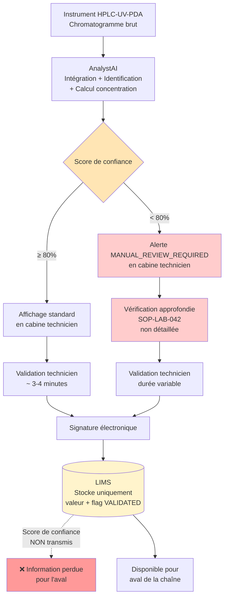

# PAGE 2 — ANALYSTAI (Groupe 1 — Sujet ML/DL)
## Outil de traitement analytique automatisé

---

## Onglet 2.1 — Comment fonctionne le système

**Fournisseur :** DataChrom SAS (PME française, 45 personnes, basée à Strasbourg). Spécialisée dans le traitement automatisé de données chromatographiques. Une vingtaine de laboratoires clients en Europe, dont 4 en environnement BPL.

**Type d'IA :** Machine Learning supervisé (réseaux de neurones convolutifs entraînés sur une base massive de chromatogrammes annotés par des chimistes analystes). Pas de GenAI. Pas de LLM.

**Fonction.** AnalystAI récupère automatiquement les chromatogrammes bruts en sortie des instruments HPLC-UV-PDA du laboratoire. Pour chaque chromatogramme, il effectue : (1) l'intégration des pics chromatographiques, (2) l'identification des composés contre une base de référence interne enrichie par le laboratoire et par DataChrom, (3) le calcul des concentrations contre les courbes d'étalonnage du jour, et (4) la détection de profils chromatographiques atypiques (asymétrie de pic, coélution suspectée, dérive de ligne de base, présence de pics inattendus).

**Le score de confiance.** Pour chaque résultat produit, AnalystAI calcule un **score de confiance** sur une échelle de 0 à 100%. Ce score reflète la qualité d'ajustement du pic, la similarité spectrale avec la base de référence, et la cohérence statistique avec les autres injections de la même série. Un seuil interne défini par ToxiPharm fixe la limite de "haute confiance" à **80%**. En dessous de ce seuil, une mention *"MANUAL_REVIEW_REQUIRED"* apparaît dans l'interface technicien, accompagnée d'une recommandation textuelle (*"profil asymétrique, vérifier l'intégration manuelle"*, par exemple).

**Validation par le technicien.** Le technicien analytique consulte les résultats dans l'interface AnalystAI installée sur son poste en cabine. Il peut valider, modifier, ou rejeter chaque résultat. Pour les résultats au-dessus du seuil de 80%, la validation se fait généralement en quelques clics (3-4 minutes par chromatogramme). Pour les résultats sous le seuil, la procédure interne SOP-LAB-042 prévoit une "vérification approfondie" — sans en préciser ni la définition opérationnelle, ni la durée attendue, ni les éléments à vérifier, ni les preuves à conserver. Le technicien signe électroniquement, et la valeur validée est poussée automatiquement dans le LIMS via une API directe.

**Ce qui passe dans le LIMS.** Le LIMS reçoit la **valeur numérique finale validée** et un **flag binaire "VALIDATED"**. **Le score de confiance d'origine n'est pas transmis** : ni stocké dans le LIMS, ni accessible en aval. La procédure de transfert a été conçue par l'éditeur du LIMS il y a 8 ans, avant le déploiement d'AnalystAI, et n'a pas été révisée à cette occasion.

**Ré-entraînement du modèle.** DataChrom ré-entraîne son modèle tous les 6 mois sur une base élargie issue de l'ensemble de ses clients (les données restent agrégées et anonymisées contractuellement). Une nouvelle version du modèle est poussée à ToxiPharm via une mise à jour applicative. La note de version, fournie par DataChrom, mentionne globalement *"améliorations sur l'identification de pics minoritaires, mise à jour de la base de référence sur 14 nouvelles familles de composés"*. Aucune information détaillée sur les composés ajoutés, les jeux d'entraînement, les performances comparées version-à-version. ToxiPharm a procédé à une re-qualification opérationnelle légère lors de la dernière mise à jour, sur la base d'une dizaine d'échantillons de référence interne.

**Volume traité.** Environ **200 chromatogrammes par technicien et par semaine**. Le laboratoire emploie 8 techniciens analytiques en cabine HPLC.

---

## Onglet 2.2 — Flowchart d'AnalystAI

**Points critiques visibles sur le flowchart :**
- Le seuil de 80% déclenche une procédure ("vérification approfondie") qui n'est pas définie opérationnellement
- Le score de confiance disparaît au moment de l'écriture dans le LIMS
- Aucune information de "fragilité" de la donnée n'est portée à la connaissance des consommateurs aval

---

## Onglet 2.3 — Verbatim AnalystAI

### Karim B. — Technicien analytique senior (12 ans d'ancienneté)
*Celui qui a validé les lots #14, #17 et #21*

> "J'ai 25 alertes MANUAL_REVIEW par semaine, et la SOP me demande une 'vérification approfondie' sans dire ce que c'est. Si je passe 25 minutes sur chacune, je fais que ça de mes journées — alors j'ai fini par survoler, en 5 minutes. Sur les lots NovaPharma, on était en retard, le chef de projet me mettait la pression, j'ai validé comme d'habitude. Personne ne contrôle jamais ce que je fais sur ces alertes, donc je fais avec mon jugement et avec le temps que j'ai."

### Élodie M. — Technicienne analytique junior (3 ans d'ancienneté)
*Utilisatrice quotidienne, n'a pas validé les lots litigieux*

> "Je n'ai jamais vraiment compris comment le score de confiance est calculé, ni pourquoi le seuil est à 80%. Quand AnalystAI me dit 'asymétrie 2.31, vérifier', je n'ai pas le niveau d'expertise pour juger si c'est grave ou pas sur ce composé précis. Je signe électroniquement avec mon certificat, donc juridiquement c'est moi qui suis responsable. Mais en pratique, c'est AnalystAI qui sait, moi je valide."

### Patrick L. — Responsable Laboratoire Analytique
*Pilote opérationnel du Département Analytique*

> "On a fait la qualification initiale d'AnalystAI dans les règles : QI/QO/QP, 50 chromatogrammes de référence, signature RAQ — propre. Ce qu'on n'a pas formalisé, c'est ce qui se passe après la qualification : les mises à jour DataChrom passent en re-qualification light, et on ne suit aucune statistique sur le taux d'alertes ou le taux de modification par les techniciens. Je découvre certaines choses aujourd'hui en faisant l'enquête. On part du principe que le système est validé, donc il fonctionne."

### Dr. Marc V. — Chief Data Scientist chez DataChrom (fournisseur)
*Concepteur du modèle AnalystAI*

> "Le score de confiance, c'est notre output le plus précieux après le résultat lui-même — il intègre une vingtaine de signaux qualité de la mesure. **On suppose que ce score est utilisé en aval par nos clients**, qu'il voyage avec la donnée dans leurs systèmes. Sur les notes de version semestrielles, on reste volontairement synthétique pour ne pas noyer les utilisateurs. Si un client veut des détails techniques sur une mise à jour, il peut nous solliciter ; à ma connaissance, ToxiPharm ne l'a jamais fait."

### Sandra T. — Assistante qualité, autrice de la SOP-LAB-042
*Responsable du référentiel documentaire AnalystAI*

> "J'ai rédigé la SOP en m'inspirant de la documentation DataChrom et de la SOP existante sur l'intégration manuelle, sous pression de délai au moment du Go-Live. La formulation 'vérification approfondie' est restée vague à dessein : on devait consolider en version 2 avec les pratiques terrain, ce qui n'a jamais été fait. Sur la non-transmission du score de confiance au LIMS, on ne s'est jamais posé la question — on considérait que la validation technicien purgeait le score. Avec le recul, c'est une zone aveugle, mais on n'avait pas ReportFlow à l'époque."

### Christine D. — Responsable Assurance Qualité (RAQ) de ToxiPharm
*Sur la qualification d'AnalystAI et la gouvernance globale*

> "La qualification initiale était propre, je ne change rien. Là où je porte une responsabilité, c'est sur la **revue périodique** : AnalystAI est ré-entraîné tous les 6 mois, donc ce qui tournait il y a 14 mois et ce qui tourne aujourd'hui sont deux modèles différents, et nos contrôles de mise à jour sont très insuffisants. J'ai signalé en CODIR il y a quatre mois que la chaîne AnalystAI + LIMS + ReportFlow n'avait jamais été qualifiée comme une chaîne, on m'a opposé que c'était excessif. Je n'ai pas insisté — j'aurais dû."
