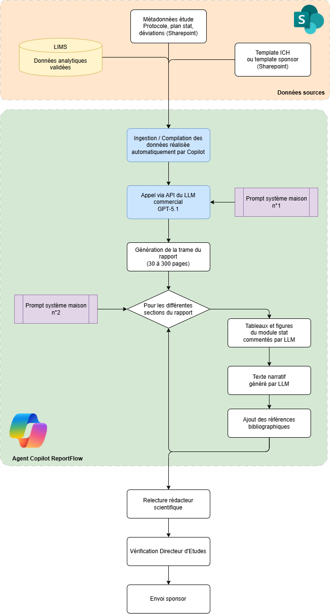

# PAGE 3 — REPORTFLOW (Groupe 2 — Sujet IA Générative)
## Outil interne d'assistance à la rédaction des rapports d'étude

---

## Onglet 3.1 — Comment fonctionne le système

**Volume traité** : **6 rapports d'étude rendus via ReportFlow** en 5 mois (3 rapports pivotaux pour AMM, 3 rapports intermédiaires), pour 4 sponsors distincts. Ces rapports font de 30 à 300 pages et sont produits en une seule passe, sans découpage en sous-tâches contrôlées section par section.

**L'Origine de l'outil** : ReportFlow est un **outil développé en interne** en duo par le Responsable Assurance Qualité et par un membre de l'équipe IT de ToxiPharm. En réponse à une demande forte de la Direction vis-à-vis de la Rédaction Scientifique, ils ont eu l'idée de construire de façon autonome un agent à l'aide de **Copilot**. Le projet a démarré en octobre 2025 ; la mise en production a eu lieu en décembre 2025. Le développement a été piloté par Bernard P. (DSI). Aucun budget spécifique n'a été alloué pour ce projet pour un audit externe ou une revue de code par un tiers spécialisé. 

**Type d'IA** : Le système repose sur une IA générative basée sur un **Large Language Model (LLM) commercial** accessible via API (GPT-5.1 au moment du déploiement, avec possibilité de bascule vers Claude ou Mistral selon les coûts d'usage). Aucun fine-tuning spécifique au domaine pharmaceutique n'a été effectué : ToxiPharm utilise le modèle grand public "tel quel" et compense par un **prompt système** rédigé par l'équipe IT en s'inspirant de templates trouvés en ligne et adaptés avec Copilot. Les données d'étude, y compris des informations confidentielles appartenant aux sponsors, sont transmises à l'API du LLM commercial. Aucun contrat de traitement spécifique (DPA), aucune analyse RGPD ni clause de non-réutilisation des données n'a été formalisée avec l'éditeur.

**Architecture technique.** L'application ReportFlow est une interface web légère qui orchestre trois éléments :
1. un module d'extraction de données qui va permettre d'aller chercher les données structurées issues du LIMS via l'API standard et les données non structurées (rapports, procotoles, ...) se trouvant dans le Sharepoint
2. un module de construction du prompt qui décrit comment assemble données + métadonnées d'étude + template ICH,
3. l'appel au LLM commercial avec ce prompt et les sources de données permettant la restitution de la sortie dans une interface de relecture. Le code a été développé majoritairement avec Copilot, fonctionne en production mais n'a fait l'objet d'aucune revue de code formelle, aucun test unitaire structuré, aucune documentation technique exhaustive.

**Ce que ReportFlow rédige.** Le LLM produit l'intégralité du texte du rapport : résumé exécutif, introduction, matériel et méthodes (paraphrasé depuis le protocole), résultats (avec interprétation des tableaux et figures), discussion (avec recherche de références bibliographiques pertinentes dans sa base de connaissance), conclusion. Les tableaux et figures eux-mêmes ne sont pas générés par le LLM : ils sont produits par un module statistique séparé et insérés dans le rapport. ReportFlow rédige le texte qui commente ces tableaux.

**Les références bibliographiques.** Le prompt système demande explicitement au LLM de *"proposer des références bibliographiques scientifiques pertinentes pour appuyer la discussion"*. Le LLM produit donc des références issues de sa mémoire interne. **Aucune connexion à PubMed, Scopus ou toute base bibliographique primaire n'est implémentée** : les références sont générées par le LLM à partir de ses données d'entraînement, sans vérification automatique de leur existence réelle. Le développeur interne avait identifié ce risque dès la conception, mais le développement d'une intégration PubMed avait été reporté à la "v2" — qui n'a jamais été lancée.

**Validation par le rédacteur scientifique.** Le rédacteur scientifique reçoit le premier jet de ReportFlow via l'interface web. Il peut accepter, modifier, ou rejeter chaque paragraphe. L'interface met en surbrillance les passages où le LLM signale lui-même une "confiance modérée" (mécanisme implémenté via un second appel au LLM lui demandant d'auto-évaluer son texte). Le temps moyen de relecture d'un rapport intermédiaire est passé de 3 jours en rédaction manuelle à **1 jour avec ReportFlow**. Sur les rapports pivotaux, le gain est de l'ordre de 40%.

**Signature et envoi.** Une fois validé par le rédacteur, le rapport est soumis au **Directeur d'Études** (DE) qui signe en sa qualité de responsable scientifique conformément aux BPL. Le RAQ procède à une revue qualité indépendante avant l'envoi au sponsor.

**Charte d'usage.** Une charte interne d'une page, rédigée à la va-vite au moment du Go-Live, indique que *"ReportFlow est un assistant de rédaction, jamais un décideur"* et que *"le rédacteur reste pleinement responsable du contenu"*. Aucune procédure formelle ne définit ce que doit vérifier le rédacteur, dans quelles proportions, ni les preuves à conserver de cette vérification.

---

## Onglet 3.2 — Flowchart de ReportFlow

**Points critiques visibles sur le flowchart :**
- ReportFlow lit le LIMS et traite toutes les données comme également fiables (le score de confiance n'est plus là)
- Les références bibliographiques sont générées sans connexion aux bases primaires — risque d'hallucination structurel
- Aucun point de contrôle distinct entre sections "factuelles" (résultats) et sections "narratives" (discussion, références)
- Le code de l'application n'a pas été audité par un tiers spécialisé, et aucune analyse de sécurité (notamment le risque d'injection de prompt via les documents non structurés du Sharepoint) n'a été menée

---

## Onglet 3.3 — Verbatim ReportFlow

### Antoine R. — Rédacteur Scientifique Senior (8 ans d'ancienneté)
*Celui qui a relu et validé le rapport ZB-2025-087*

> "J'ai relu le rapport ZB-2025-087 de manière standard : structure, cohérence, conclusions cohérentes avec les tableaux tout collait. Je n'ai pas vérifié toutes les références bibliographiques car elles paraissaient conformes. Sur un rapport pivotal, nous pouvons en avoir jusqu'à 60-80 et vérifier chaque DOI prend quasiment une journée. Parfois je vérifie au hasard 2-3 références suspectes et je fais confiance pour le reste. 
> Concernant les résultats analytiques, il proviennent du LIMS qui est un système validé, donc je ne vais pas les rmettre en cause : mon métier c'est la qualité rédactionnelle, pas la qualité analytique. 
> J'avoue que sur la conclusion erronée 'absence d'effet dose-réponse', j'aurais dû refaire l'analyse avec les données du tableau."

### Léa H. — Rédactrice Scientifique Junior (6 mois d'ancienneté)
*Recrutée au moment du déploiement de ReportFlow*

> "Je n'ai encore jamais rédigé un rapport entièrement à la main, je relis ReportFlow ; c'est mon métier. La plupart du temps, ReportFlow écrit éxtrêmement bien, mieux même que je ferais par moi-même. 
> Nous n'avons pas spécialement de procédure de relecture structurée, ou de checklist — je relis comme je peux dans le rush des dossiers.
> La formation initiale à ReportFlow portait essentiellement sur l'interface, pas sur les modes de défaillance des LLM ; on m'a juste dit 'attention aux hallucinations' avec un exemple du quotidien.
> Sinon, l'outil est plutôt sympa, en tant que junior, je me sers aussi de ses connaissances pour lui demander d'autres choses liées à mon métier."

### Sophie M. — Responsable Rédaction Scientifique
*Manage l'équipe de 4 rédacteurs*

> "ReportFlow a transformé le service : on tient enfin les délais, l'équipe respire. Sur les défaillances actuelles, je fais mon mea-culpa : la charte d'usage tient sur une page. ReportFlow s'est imposé à nouveau dans un moment difficile, et nous n'avons pas pris le temps de définir opérationnellement les étapes de vérifications des informations (toutes ? par échantillonnage ? quel temps ?). Le partage de responsabilité entre équipes analytique et équipes rédactionnelles est aussi resté flou : avant, le rédacteur recopiait les chiffres ; maintenant, ReportFlow les **interprète** (ex : 'cohérent', 'stable', 'maîtrisé') et le rédacteur valide cette interprétation sans avoir les compétences analytiques pour la juger. C'est un trou dans la raquette que je n'avais pas vu."

### Marc D. — Développeur interne ToxiPharm, concepteur de ReportFlow
*A développé l'application avec GitHub Copilot*

> "On a livré ReportFlow en 2 mois grâce à Copilot, ce qui aurait pris 6 mois en développement classique, la direction était ravie. C'est la force des application dite 'Low-Code'. 
> Sur la qualité du code, ce n'est pas vraiment mon métier, mais il fonctionne en production. Un collègue m'a demandé si j'avais fait une revue de code formelle, ni tests unitaires structurés, ni audit sécurité — on avait des délais. 
> J'avais identifié dès la conception le risque d'hallucination sur les références biblio et proposé une connexionn avec PubMed, mais ça a été reporté en v2, parce que ce n'était pas dans le scope initial. La v2 n'a jamais été lancée. La direction a considéré qu'on avait livré, on est passés à autre chose.
> J'ai trouvé un petit site qui liste des références biblio, je vais essayer de l'intégrer à ReportFlow pour améliorer ce point.
> J'ai fait évoluer les 2 prompts systèmes à plusieurs reprises (peut-être 2 fois par mois en moyenne) pour les optimiser petit à petit. A chaque fois je vérifie quelques items de sortie pour confirmer que tout est OK.
> Et honnêtement, quand l'éditeur met à jour son modèle derrière l'API, je ne suis pas prévenu : la sortie peut changer du jour au lendemain sans que personne ne le voie. On n'a aucun suivi des hallucinations ni du taux de corrections des rédacteurs, donc une dérive passerait inaperçue."

### Bernard P. — DSI / IT Manager de ToxiPharm
*A piloté le projet ReportFlow*

> "Le projet ReportFlow a été piloté par l'IT en sponsoring de la Rédaction Scientifique. Sur le périmètre du connecteur LIMS, on a transmis à ReportFlow ce que le LIMS expose dans son API standard — valeur validée + flag de statut. Je n'ai jamais entendu parler des fameux 'scores de confiance' d'AnalystAI sur lesquels tout le monde discute aujourd'hui. Personne ne nous a dit 'au fait, AnalystAI génère des scores qu'il faudrait peut-être inclure'. 
> On n'est pas chimistes, notre rôle c'est de connecter les systèmes existants. On n'a pas invité le Département Analytique aux ateliers de conception de ReportFlow — c'est une faille d'architecture de l'information dont je porte la responsabilité.
> Sur la confidentialité, j'avoue qu'on n'a pas tranché : on envoie des données sponsor vers une API externe sans avoir vérifié ce que l'éditeur en fait. Personne ne m'a posé la question au lancement."

### Pr. Hervé F. — Directeur d'Études (DE) ZB-2024-087
*A signé le rapport en sa qualité de DE BPL*

> "Je suis DE depuis 22 ans, j'ai signé environ 150 rapports — la signature DE engage scientifiquement sur la conduite de l'étude et ses conclusions. Sur ZB-2024-087, j'ai relu la structure, les sections méthodologiques, les conclusions — ça collait à ce que je sais du composé. Sur les références biblio, je ne les ai pas vérifiées — je ne l'ai jamais fait sur aucun rapport, je faisais confiance au rédacteur. 
> Ma signature de DE reposait jusqu'à présent sur des **présomptions de fiabilité** (données LIMS validées, rapport relu) ; là je constate que l'IA générative n'est pas si intelligente que cela. Elle interprête l'information en chemin."
