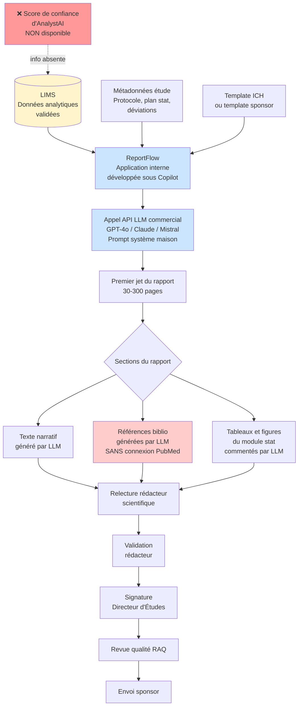

# PAGE 3 — REPORTFLOW (Groupe 2 — Sujet IA Générative)
## Outil interne d'assistance à la rédaction des rapports d'étude

---

## Onglet 3.1 — Comment fonctionne le système

**Origine de l'outil.** ReportFlow est un **outil développé en interne** par l'équipe IT de ToxiPharm avec l'aide de **GitHub Copilot**, en réponse à une demande forte de la Direction de la Rédaction Scientifique. Le projet a démarré en octobre 2025 ; la mise en production a eu lieu en décembre 2025. Le développement a été piloté par Bernard P. (DSI) avec un développeur interne junior et un consultant externe sur 2 mois. Aucun budget n'a été alloué pour un audit externe ou une revue de code par un tiers spécialisé.

**Type d'IA :** IA générative basée sur un **Large Language Model (LLM) commercial** accessible via API (GPT-4o au moment du déploiement, avec possibilité de bascule vers Claude ou Mistral selon les coûts d'usage). Aucun fine-tuning spécifique au domaine pharma n'a été effectué : ToxiPharm utilise le modèle "tel quel" et compense par un **prompt système** rédigé par l'équipe IT en s'inspirant de templates trouvés en ligne et adaptés avec Copilot.

**Architecture technique.** L'application ReportFlow est une interface web légère qui orchestre trois éléments : (1) un module d'extraction des données structurées du LIMS via l'API standard, (2) un module de construction du prompt qui assemble données + métadonnées d'étude + template ICH, (3) l'appel au LLM commercial avec ce prompt et restitution de la sortie dans une interface de relecture. Le code a été développé majoritairement avec Copilot, fonctionne en production mais n'a fait l'objet d'**aucune revue de code formelle, aucun test unitaire structuré, aucune documentation technique exhaustive**.

**Ce que ReportFlow rédige.** Le LLM produit l'intégralité des sections narratives : résumé exécutif, introduction, matériel et méthodes (paraphrasé depuis le protocole), résultats (avec interprétation des tableaux et figures), discussion (avec recherche de références bibliographiques pertinentes dans sa base de connaissance), conclusion. Les tableaux et figures eux-mêmes ne sont pas générés par le LLM : ils sont produits par un module statistique séparé et insérés dans le rapport. ReportFlow rédige le **texte qui commente ces tableaux**.

**Les références bibliographiques.** Le prompt système demande explicitement au LLM de *"proposer des références bibliographiques scientifiques pertinentes pour appuyer la discussion"*. Le LLM produit donc des références issues de sa mémoire interne. **Aucune connexion à PubMed, Scopus ou toute base bibliographique primaire n'est implémentée** : les références sont générées par le LLM à partir de ses données d'entraînement, sans vérification automatique de leur existence réelle. Le développeur interne avait identifié ce risque dès la conception, mais le développement d'une intégration PubMed avait été reporté à la "v2" — qui n'a jamais été lancée.

**Validation par le rédacteur scientifique.** Le rédacteur scientifique reçoit le premier jet de ReportFlow via l'interface web. Il peut accepter, modifier, ou rejeter chaque paragraphe. L'interface met en surbrillance les passages où le LLM signale lui-même une "confiance modérée" (mécanisme implémenté via un second appel au LLM lui demandant d'auto-évaluer son texte). Le temps moyen de relecture d'un rapport intermédiaire est passé de 3 jours en rédaction manuelle à **1 jour avec ReportFlow**. Sur les rapports pivotaux, le gain est de l'ordre de 40%.

**Signature et envoi.** Une fois validé par le rédacteur, le rapport est soumis au **Directeur d'Études** (DE) qui signe en sa qualité de responsable scientifique conformément aux BPL. Le RAQ procède à une revue qualité indépendante avant l'envoi au sponsor.

**Charte d'usage.** Une charte interne d'une page, rédigée à la va-vite au moment du Go-Live, indique que *"ReportFlow est un assistant de rédaction, jamais un décideur"* et que *"le rédacteur reste pleinement responsable du contenu"*. Aucune procédure formelle ne définit ce que doit vérifier le rédacteur, dans quelles proportions, ni les preuves à conserver de cette vérification.

**Volume traité.** **6 rapports d'étude rendus via ReportFlow** en 5 mois (3 rapports pivotaux pour AMM, 3 rapports intermédiaires), pour 4 sponsors distincts.

---

## Onglet 3.2 — Flowchart de ReportFlow

**Points critiques visibles sur le flowchart :**
- ReportFlow lit le LIMS et traite toutes les données comme également fiables (le score de confiance n'est plus là)
- Les références bibliographiques sont générées sans connexion aux bases primaires — risque d'hallucination structurel
- Aucun point de contrôle distinct entre sections "factuelles" (résultats) et sections "narratives" (discussion, références)
- Le code de l'application n'a pas été audité par un tiers spécialisé

---

## Onglet 3.3 — Verbatim ReportFlow

### Antoine R. — Rédacteur Scientifique Senior (8 ans d'ancienneté)
*Celui qui a relu et validé le rapport ZB-2024-087*

> "J'ai relu le rapport ZB-2024-087 de manière standard : structure, cohérence, conclusions cohérentes avec les tableaux — tout collait. Sur les références bibliographiques, je ne les vérifie quasiment plus : sur un rapport pivotal il y en a 60 à 80, vérifier chaque DOI prend une journée et personne ne m'a explicitement demandé de le faire — donc je fais un sondage sur 2-3 références suspectes et je fais confiance pour le reste. Sur les chiffres du LIMS, je n'ai pas le réflexe de les remettre en cause : ce sont des données validées par les techniciens, mon métier c'est la qualité rédactionnelle, pas la qualité analytique. Sur la phrase 'absence d'effet dose-réponse', j'aurais dû refaire l'analyse stat, je ne l'ai pas fait — sur ce point précis, c'est ma faute."

### Léa H. — Rédactrice Scientifique Junior (14 mois d'ancienneté)
*Recrutée au moment du déploiement de ReportFlow*

> "Je n'ai jamais rédigé un rapport entièrement à la main, je relis ReportFlow — c'est mon métier. Quand vous lisez quelque chose de très bien écrit, vous avez tendance à le valider : ma question intérieure n'est plus 'est-ce que c'est vrai' mais 'est-ce que ça sonne bien'. La formation initiale de deux heures portait sur l'interface, pas sur les modes de défaillance des LLM ; on m'a juste dit 'attention aux hallucinations' avec un exemple. Aucune procédure de relecture structurée, aucune checklist — je relis comme je peux dans le rush des dossiers."

### Sophie M. — Responsable Rédaction Scientifique
*Manage l'équipe de 4 rédacteurs*

> "ReportFlow a transformé le service : on tient enfin les délais, l'équipe respire. Sur les défaillances actuelles, je fais mon mea-culpa — la charte d'usage tient sur une page pour un outil aussi structurant, et je n'ai jamais défini opérationnellement ce que 'vérifier les références' veut dire (toutes ? par échantillonnage ? quel temps ?). Le partage de responsabilité analytique/rédactionnel est aussi resté flou : avant, le rédacteur recopiait les chiffres ; maintenant, ReportFlow les **interprète** ('cohérent', 'stable', 'maîtrisé') et le rédacteur valide cette interprétation sans avoir les compétences analytiques pour la juger. C'est un trou de gouvernance que je n'avais pas vu."

### Marc D. — Développeur interne ToxiPharm, concepteur de ReportFlow
*A développé l'application avec GitHub Copilot*

> "On a livré ReportFlow en 2 mois grâce à Copilot, ce qui aurait pris 6 mois en développement classique — la direction était ravie. Sur la qualité du code : il fonctionne en production, mais on n'a fait ni revue de code formelle, ni tests unitaires structurés, ni audit sécurité — on avait des délais. **J'avais identifié dès la conception le risque d'hallucination de références et proposé une intégration PubMed, mais ça a été reporté en v2** parce que ce n'était pas dans le scope initial. La v2 n'a jamais été lancée — la direction a considéré qu'on avait livré, on est passés à autre chose."

### Bernard P. — DSI / IT Manager de ToxiPharm
*A piloté le projet ReportFlow*

> "Le projet ReportFlow a été piloté par l'IT en sponsoring de la Rédaction Scientifique. Sur le périmètre du connecteur LIMS, on a transmis à ReportFlow ce que le LIMS expose dans son API standard — valeur validée + flag de statut, mais pas les scores de confiance d'AnalystAI qui ne sont pas stockés dans le LIMS. Personne ne nous a dit 'au fait, AnalystAI génère des scores qu'il faudrait peut-être inclure' — on n'est pas chimistes, notre rôle c'est de connecter les systèmes existants. On n'a pas invité le Département Analytique aux ateliers de conception de ReportFlow — c'est une faille d'architecture de l'information dont je porte la responsabilité."

### Pr. Hervé F. — Directeur d'Études (DE) ZB-2024-087
*A signé le rapport en sa qualité de DE BPL*

> "Je suis DE depuis 22 ans, j'ai signé environ 150 rapports — la signature DE engage scientifiquement sur la conduite de l'étude et ses conclusions. Sur ZB-2024-087, j'ai relu la structure, les sections méthodologiques, les conclusions — ça collait à ce que je sais du composé. Sur les références biblio, je ne les ai pas vérifiées — je ne l'ai jamais fait sur aucun rapport, je faisais confiance au rédacteur. Ma signature de DE repose sur des **présomptions de fiabilité** (données LIMS validées, rapport relu) qui ne sont plus tenables quand une IA générative a interprété l'information en chemin — je signe sur une base de confiance que la chaîne actuelle ne mérite peut-être plus."
